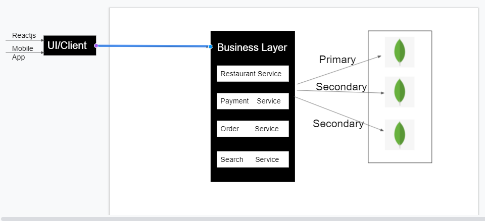

# `Restaurant Product`
Note -- this is in active development

#### Services
- Restaurant --to add images, reviews ,menu , new restaurant , filter restaurants.
- Search     --to get cityid , restaurant detail , collections .
- Auth       --authenticating user & sending otp. 

[Live Link](https://eathub-nbackend.herokuapp.com)

#### Screenshots

<table>
  <tr>
    <td>Current Architecture</td>
  </tr>
  <tr><td>
			|  
			|  
			|  
			|  
			|  
			|  
  </td></tr>
  <tr>
   <td>Aimed Architecture</td>
  </tr>
</table>

### `Built With`

<table  align=center>
  <tr>
 <td align=center> </td>
     <td align=center> </td>
	 <td align=center> </td>
     <td align=center> </td>
 
 </tr>
 
</table>

### `Overview`

- Input Validation for submission of form data.
- Mongoose for connecting to database.
- NodeMailer + OAuth for authenticating users.

### `Ongoing development`
- jwt for securing routes 
- csurf token to prevent csrf.

## Show your support

Give a star, if you like this project!  
Contributions & feedbacks are welcome!

